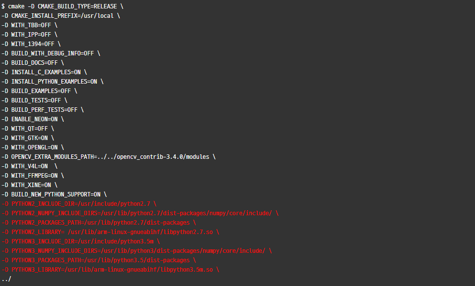

# **프로젝트 소개**

   * 시각장애인에게 **딥 러닝(Deep Learing)**기반의 웨어러블 기기를 제공함으로써 앞의 사물이 무엇인지 알려줍니다.
   * 눈에 보이지 않는 시각장애인들에게 시각을 필요로하는 잡지나 기사의 텍스트를 인식하는 웨어러블 기기를 제공합니다.
   * 부정적 시선의 불편함을 느끼는 시각장애인들을 위해 앞에 있는 사람의 감정을 인식하여 음성으로 알려줌으로써 눈이 보이지 않는 단점을 보완합니다.

#### 시스템 구성도


#### **작품 기능**
  *  객체(사물) 인식 : 이미지 및 동영상 촬영을 통한 검출 된 사물에 대한 정보 제공
  *  텍스트 인식 : 이미지에서 텍스트를 추출한 후 음성으로 변환하여 제공
  *  감정 인식  : 얼굴을 검출한 경우, 대상에 대한 감정을 파악한 뒤 정보 제공


# Viewtiful Eyes 시작하기

* #### [설치 방법 및 실행 환경](#설치-방법-및-실행-환경)
	* [라즈베리파이](#라즈베리파이)
	* [블루투스](#블루투스)
	* [윈도우](#윈도우)
	* [API](#API)
	
* #### [사용방법](#사용-방법)
	* [버튼조작](#버튼-조작)
	
* #### [라이센스](#라이센스)


## 설치 방법 및 실행 환경 
본 프로젝트의 통신 방법은 TCP/IP 소켓통신을 무선인터넷환경(Wi-Fi)에서 진행되었으며, 각 기능을 구현하기 위해  기존의 오픈소스인 YOLO version2, Tesseract engine, Emotion Detection using CNN, Naver Clova API를 이용하여 개발하였다. 

### 라즈베리파이 
* 본 프로젝트에서는 라즈베리파이 3 Model B V1.2를 사용합니다.
   * 하위 버전의 라즈베리파이2,B+ 버전 사용시 무선랜설정을 따로 진행하셔야 합니다.
* [라즈베리파이 하드웨어 구성](https://www.raspberrypi.org/learning/hardware-guide/equipment/)
  * 라즈베리파이 하드웨어 구성은 위 링크를 참조하시기 바랍니다.
* [라즈비안 설치 방법](https://www.raspberrypi.org/learning/software-guide/quickstart/)
  * 라즈비안 설치 방법은 위 링크를 참조하시기 바랍니다.
  * 라즈비안은 [Raspbian-jessie 버전](https://www.raspberrypi.org/downloads/raspbian/)을 사용하였습니다.
* 사용된 코드는 python언어로 작성되었습니다.

#### 라즈베리파이 초기 설정
* 라즈베리파이3 기준의 초기 설정입니다.
* 라즈비안 부팅후 터미널을 실행 하여 다음 명령어를 입력합니다. 
	```  
	sudo raspi-config
	```
   * Localisation Options으로 들어가서 다음 과정을 진행 합니다.
    T1 Change Locale은 언어 세팅 입니다. 다음의 언어팩을 찾아 추가 해주시기 바랍니다.
      ```
      en_US.UTF-8  
      ko_KR.UTF-8
      ```
    T2 Change Timezone은 시간 설정입니다. Asia-Seoul로 맟춰 줍니다.(외국의 경우 거주하는 국가에 맟춰 설정하시면 됩니다.)
       T3 Change Keyboard Layout은 키보드 설정입니다. 기본적인 특수문자 입력을 위해 설정합니다. Generic 105-key (Intl) PC 내에서 Korean-Korean(101/104key compatible)을 추천합니다. (외국의 경우 국가의 키보드 세팅에 맟춰 설정하시면 됩니다.)
       T4 Chage Wi-Fi Country는 와이파이 설정입니다. KR설정시 와이파이 ARP를 찾지 못하는 현상이 있습니다. US로 설정하시어 무선랜을 사용하시는것을 추천합니다. 
    해당 진행 완료후 재부팅 합니다.
* 재부팅 하여 와이파이 연결 후 필수 패키지 업데이트를 위해 터미널에서 다음 명령어를 실행합니다. 
    ```
    sudo apt-get update && sudo apt-get upgrade
    ```

##### **사용방법**
설치/실행환경이 구성이 완료되면 플랫폼을 사용하실 수 있습니다.
사용방법은 아래항목을 참조하세요.

##### 라즈베리파이 실행파일 사용방법
  * 소스코드파일과 실행파일을 라즈베리파이에 다운받습니다.
  * 터미널 실행 후 실행파일이 있는 경로로 이동 후 실행파일을 아래와 같이 실행하시면 됩니다.

	```
	sudo ./TestClient
	sudo ./TestClient_Encrypt
	```


#### 블루투스
   라즈베리파이3 모델은 기본적으로 Bluetooth를 제공하기 때문에 따로 패키지를 설치 안해주어도 무방합니다.

##### 사운드 시스템 설치

* 블루투스 이어폰으로 사운드를 송출하기 위해서는 기본적으로 제공되는 ALSA 사운드 시스템 외에 Bluetooth를 지원하는 pulseaudio 사운드 시스템 설치가 필요합니다.

	```
	sudo apt-get install Bluetooth bluez blueman pulseaudio
	```

* 설치가 완료되면 HDMI/Analog/Bluetooth를 제공하는 pulseaudio 사운드 시스템을 사용이 가능합니다.
* ALSA와 pulseaudio의 자세한 비교는 다음 [링크](http://guzene.tistory.com/186)로 확인이 가능합니다.

##### 실행 및 종료 방법
* 실행 종료 코드
	```
	pulseaudio –start / sudo killall pulseaudio
	```
##### 라즈베리파이와 블루투스 연동 방법
* 라즈베리파이에서 블루투스로 소리를 출력하기 위해서는 Bluetooth를 지원하는 사운드 시스템 뿐만 아니라 블루투스 사운드를 재생 할 mplayer가 필요합니다.
* 라즈베리파이에서 기본 제공되는 omxplayer는 블루투스 사운드를 재생 할 수 없습니다.
	```
	sudo apt-get install mplayer
	```
  
* 블루투스 이어폰을 연결하기 위해 다음 과정을 수행합니다.
	1. 터미널 내 bluetoothctl 쳐서 블루투스 모드로 진입합니다.
	2. 명령어 scan on을 이용하여 주변 장치 검색합니다.
	3. 명령어 pair xx:xx:xx:xx:xx:xx(이어폰 MAC 주소) 을 통해 장치와 페어링을 합니다.
	4. 명령어 trust xx:xx:xx:xx:xx:xx(이어폰 MAC 주소) 을 통해 페어링 된 장치가 다음에도 연결이 될 수 있도록 설정합니다.
	5. 명령어 connect xx:xx:xx:xx:xx:xx(이어폰 MAC 주소) 을 통해 블루투스 이어폰과 라즈베리파이를 연결합니다.

- 지금까지의 과정을 거치면 블루투스 이어폰으로도 사운드 출력이 가능한 상태가 되었습니다. 하지만 사운드 채널또한 맞춰주어야만 블루투스 이어폰으로 사운드 송출이 가능합니다. 
- 사운드 채널을 맞춰주기 위해서는 설치하였던 다음과 같은 pulseaudio 명령어들을 사용합니다.
	1. 밑 명령어를 이용하여 어떤 장치가 잡혀있는지 알 수 있습니다.
	
	```
	pacmd list-sink
	```

2. 블루투스 이어폰이 연결이 되면(*) index 0 이외에도 index 1의 장치가 있는것을 볼 수 있습니다.(무조건적으로 index1이 아니라 name: <bluez_sink.MAC주소>를 가진 장치가 잡힙니다.)
3. 앞의 *는 활성화를 의미합니다. 블루투스 이어폰을 활성화하기 위해서 다음 명령어를 입력합니다.

	```
	pacmd set-default-sink[index or name]
	```
 위의 과정들을 거치면 블루투스 이어폰으로의 사운드 송출은 가능한 상태이지만 프로파일이 headset 모드로 적용되어 음질이 상당히 떨어집니다. 따라서 고음질을 제공하는 A2DP 모드로 변경시켜주어야 합니다.
* Headset mode는 양방향이지만 저음질을 지원하고 A2DP mode는 단방향이지만 고음질을 지원합니다.
* A2DP 프로파일 변경 후 .mp3파일을 재생하기 위하여 설치하였던 mplayer를 이용하여 파일을 재생합니다.
	```
	pacmd set-card-profile bluez_card.[MAC주소] a2dp_sink
	mplayer -ao [파일명]
	```

##### 라즈베리파이와 카메라 연동 방법
* 라즈베리파이 내에서 파이썬 코드와 연동하여 카메라를 사용하기 위해서는 OpenCV3 라이브러리 설치가 필요합니다. 
* OpenCV3 컴파일 전 필요한 패키지들이 필요합니다. 다음과 같은 명령어들로 필요 패키지들을 설치합니다.
	```
	sudo apt-get install build-essential cmake pkg-config
	sudo apt-get install libjpeg-dev libtiff5-dev libjasper-dev libpng12-dev
	sudo apt-get install libavcodec-dev libavformat-dev libswscale-dev libxvidcore-dev libx264-dev libxine2-dev
	sudo apt-get install libv4l-dev v4l-utils
	sudo apt-get install python2.7-dev python3-dev python-numpy python3-numpy
	```

#### OpenCV3 라이브러리 설치 방법
* 필요 패키지들을 다 설치하였다면 OpenCV 설정과 컴파일 및 설치를 해줍니다.
* 설치할 디렉토리를 만들어 준 후 다음 명령어로 opencv 라이브러리를 설치 후 압축을 풀어줍니다.
	```
	wget -0 opencv.zip http://github.com/opencv/opencv/archive/3.4.3.zip
	wget -0 opencv_contrib.zip http://github.com/opencv/opencv/archive/3.4.3.zip
	unzip opencv.zip
	unzip opencv_contrib.zip
	```
* 압축을 풀어준 opencv-3.4.3 디렉토리로 이동 후 build 디렉토리 생성하여 cmake를 이용하여 컴파일 설정을 해줍니다.
* cmake를 사용하여 OpenCV 컴파일 설정은 다음과 같습니다.


#### OpenCV3 설치 결과 확인
* python3.x 에서 opencv 라이브러리를 사용 가능한지는 파이썬3 실행 후 다음과 같이 확인합니다.
	```
	>>>import cv2
	>>>cv2.__version__
	'3.4.0'
	>>>
	```

### 윈도우
  윈도우 운영체제는 window 10 Pro 버전을 사용합니다.

#### Anaconda (python3.5.4) 
개발언어는 Python 3.5 버전을 사용하였습니다
개발 패키지는 딥러닝에 필요한 수학 분야에 필요한 거의 모든 패키지(Numpy, SciPy, IPython 등)이 포함되어 있는 아나콘다 패키지를 사용하였습니다.

  ##### 설치 방법
   *  아나콘다 [홈페이지](https://www.anaconda.com/download/) 접속해서 운영체제에 맞는 패키지 설치 
   *  아나콘다 3.5버전 설치 후 Anaconda Prompt를 실행합니다.
  ##### 실행 예시
* 아나콘다 가상환경 만들기
	```
	python -m pip install --upgrade pip
	conda update -n base conda
	conda create --name [envName] python=3.5.4
	conda info --envs
	activate [envName]
	```
#### Pycharm IDE
 jetBrains  Pycharm Community Edition 2017.3 버전을 사용하였습니다.
  ##### 설치 방법
   * 파이참 [홈페이지](https://www.jetbrains.com/pycharm/download/) 접속해서 운영체제에 맞는 Community 버전 Pycharm IDE 설치합니다.
  ##### interpreter 설치 방법
   * 파이참 사용시 시스템에 사용된 라이브러리 설정 및 고유환경을 설정하기 위한 작업이 필요합니다
> File -> settings ->Project -> Project interpreter 이동
> 톱니바퀴 모양 add local 클릭
> conda Environment -> Existing environment 선택 후 기존에 만들어 놓은 Anaconda 가상환경을 추가해줍니다. 


#### 사물 인식 [YOLO Library](https://pjreddie.com/darknet/yolo/)
  사물 인식기능을 구현을 위해 YOLO(in darknet)에서 문서 및 weight 파일을 가지고 기능을 구현했습니다.
  YOLO 버전 2 문서를 가지고 구현하였으며, weight 파일은 yolo을 사용하였습니다
  ##### 설치 방법
  * Cython 확장 기능을 구현합니다 (디렉토리 darkflow.net에 있는 flow.py의 있는 디렉토리에서 실행합니다)
	```
	python3 setup.py build_ext --inplace
	```
  * 필요 패키지 설치
   	```
	conda install -c conda-forge/label/broken opencv
	pip install opencv-python
	pytesseract :  conda install -c jim-hart pytesseract
	conda install -c anaconda tensorflow-gpu
	pip install --ignore-installed --upgrade tensorflow-gpu
	conda install -c anaconda scipy
	conda install -c conda-forge matplotlib
	conda install -c conda-forge keras
	```
	
  ##### 실행 방법
  * 사물인식 데모 version 
    * CPU Version
    
	```
	flow --model cfg/yolo-new.cfg --load bin/yolo-new.weights --demo videofile.avi
	```

    * GPU Version
   
	```
	flow --model cfg/yolo-new.cfg --load bin/yolo-new.weights --demo videofile.avi --gpu 1.0
	```
>웹캠 / 카메라를 사용하려면 videofile.avi 키워드를 camera로 바꾸기만 하면됩니다.

  * Client/ Server version
    * Code/MainServer/Relumin/darkflow/net/Server.py 파일을 이용합니다.
        return_predict(img)에 numpy.ndarray 형식의 이미지를 미리로드하고 실행합니다 이미지 파일을 제대로 전달하지 않으면 동작하지 않습니다.  
##### 실행 예시
* code
	```
	options = {"model": "cfg/yolo.cfg", "load": "bin/yolo.weights", "threshold": 0.1}
	tfnet = TFNet(options)
	img = cv2.imread("./sample_img/sample_dog.jpg")

	def object_detection(img):	
    		result = tfnet.return_predict(img) #YOLO 기능으로 판별된 객체 반환
    		resultString = ''
    		tempList = []
    		for i in range(len(result)):
        		tempList.append(result[i]['label'] + '. ')
    		tempList = list(set(tempList))

    		if len(tempList) != 0:
        		resultString = ''.join(tempList)
        		# resultString = trans(resultString) #한글로 결과를 전송하여 듣고싶은경우 사용
        		conn.send(resultString.encode('utf-8'))
    		else:
        		resultString = 'Please try again, there is no object in front or a recognition error.'
        		conn.send(resultString.encode('utf-8'))
    
    		print("보낸 문자 :" + resultString)
	```


#### 텍스트 인식 [Tesseract OCR Engine]
기본 엔진을 tesseract OCR로 하며, 이미지 속 텍스트의 인식률을 높이기 위해 전처리 과정으로 흑백필터, 노이즈 제거, AdaptiveThreshold 등을 거칩니다.

##### 설치 방법
Tesseract OCR 설치파일을 [다운로드](https://digi.bib.uni-mannheim.de/tesseract/)합니다. 

##### 실행 방법
  * 위 경로에서 버전에 맞게 설치파일을 다운로드합니다.
  * 설치 시 tesseract OCR의 설치 경로를 꼭 기억해야합니다.
  * 필요 라이브러리 install 방법
	```
	pip install pytesseract
	pip instal pillowl
	pip install image
	```

##### 실행 예시
* code
	```
	import pytesseract
	from PIL import Image

						#Tesseract-OCR 설치 경로
	pytesseract.pytesseract.tesseract_cmd = 'C:/Program Files (x86)/Tesseract-OCR/tesseract'
	im = Image.open('result.png')
	text = pytesseract.image_to_string(im, lang='eng') 
	print(type(text))
	print(text)
	```

  


#### 감정 인식 [Emotion Detection using CNN]
사물 인식기능을 구현하기 위해 fer2013/IMDB 데이터 셋을 사용하였으며, 케라스을 백앤드로 사용하여
  CNN 모델과 OpenCV를 사용하여 구현하였다.

##### 설치방법
사물인식 설치패키지와 환경 동일
	
##### 실행 방법
  * Client / Server version
    * Code/MainServer/Relumin/darkflow/net/Server.py 파일을 이용합니다.
     emotion_detection 함수안에 numpy.ndarray 형식의 이미지를 미리로드하고 실행합니다 이미지 파일을 제대로 전달하지 않으면 동작하지 않습니다. 반환값으로는 보낸문자를 출력하며, Client에게 정보를 전송한다. 
##### 실행 예시
* code
	```
	def emotion_detection(img):
 	emotion_text = None

	gray_image = cv2.cvtColor(img, cv2.COLOR_BGR2GRAY)
	rgb_image = cv2.cvtColor(img, cv2.COLOR_BGR2RGB)
	faces = detect_faces(face_detection, gray_image)
    
    	for face_coordinates in faces:
    
        	x1, x2, y1, y2 = apply_offsets(face_coordinates, emotion_offsets)
        	gray_face = gray_image[y1:y2, x1:x2]
        	try:
            		gray_face = cv2.resize(gray_face, (emotion_target_size))
        	except:
            		continue
    
        	gray_face = preprocess_input(gray_face, True)
        	gray_face = np.expand_dims(gray_face, 0)
        	gray_face = np.expand_dims(gray_face, -1)
        	emotion_prediction = emotion_classifier.predict(gray_face)
        	emotion_probability = np.max(emotion_prediction)
        	emotion_label_arg = np.argmax(emotion_prediction)
        	emotion_text = emotion_labels[emotion_label_arg]
        	emotion_window.append(emotion_text)
    
        	if len(emotion_window) > frame_window:
            		emotion_window.pop(0)
        	try:
            		emotion_mode = mode(emotion_window)
        	except:
            		continue
    	if emotion_text == None:
        	emotion_text = 'Please try again, Emotion recognition error.'
        	conn.send(emotion_text.encode('utf-8'))
    	else:
        	# text = trans(text) #한글로 결과를 전송하여 듣고싶은경우 사용
        	conn.send(emotion_text.encode('utf-8'))
    
    	print("보낸 문자 :" + emotion_text)
	```


### API
#### Text to Speech-[Naver Clova API](https://developers.naver.com/main/ )
Naver Clova CSS API는 Text to Speech 기능을 하기위해 사용합니다.
##### 실행 방법
* 웹 기반의 콘솔을 통해 쉽게 사용이 가능합니다.[Naver Cloud Platform](https://www.ncloud.com/product/aiService/csr) 
* CSS API 신청을 하게 되면 Client ID와 Client Secret ID를 받게 됩니다.

##### 실행 예시
* code
	```
	import os
		import sys
		import urllib.request
		client_id = "YOUR_CLIENT_ID"
		client_secret = "YOUR_CLIENT_SECRET"
		encText = urllib.parse.quote("반갑습니다 네이버")
		data = "speaker=mijin&speed=0&text=" + encText;
		url = "https://openapi.naver.com/v1/voice/tts.bin"	
		request = urllib.request.Request(url)
		request.add_header("X-Naver-Client-Id",client_id)
		request.add_header("X-Naver-Client-Secret",client_secret)
		response = urllib.request.urlopen(request,data=data.encode('utf-8'))
		rescode = response.getcode()
		if(rescode==200):
   			print("TTS mp3 저장")
	     		response_body = response.read()
	     		with open('1111.mp3', 'wb') as f:
	        		 f.write(response_body)
	 	else:
   		 print("Error Code:" + rescode)
	```
  * client_id 는 제공받은 Client ID를 기입하고 client_secret 은 제공받은 Client Screte ID를 기입하여야합니다.
   위의 예시를 이용하여 TTS(Text To Speech)기능의 결과물인 ‘1111.mp3’가 생성됨을 알 수 있습니다.


## 사용 방법
#### 라즈베리파이
##### 버튼 조작
사용자는 상황에 따라 원하는 기능을 선택할 수 있어야하는데, 그 제어를 버튼으로 합니다.
  * 참고 [사이트](https://github.com/pimoroni/button-shim)
  * 실행 예시
	```
	curl https://get.pimoroni.com/buttonshim | bash
	sudo apt-get install pimoroni
	sudo apt-get install python3-buttonshim
	sudo pip3 install buttonshim
	```

### 라이센스
		     GNU GENERAL PUBLIC LICENSE
                       Version 3, 29 June 2007

	 Copyright (C) 2007 Free Software Foundation, Inc. <http://fsf.org/>
	 Everyone is permitted to copy and distribute verbatim copies
	 of this license document, but changing it is not allowed.

